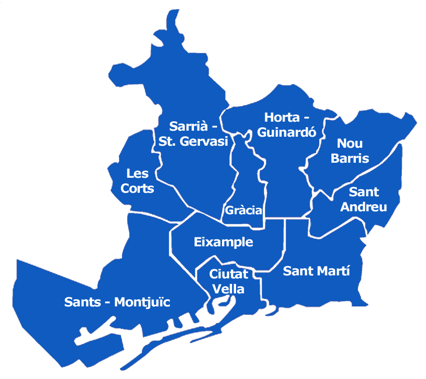

    
******
# Descripción
******
En el presente dataset se recogen ciertos datos sobre los distintos hoteles a lo largo de la ciudad de Barcelona y alrededores como parte de la practica 1 de la asignatura
Tipología y ciclo de vida de los datos del Master de ciencia de datos de la UOC.

En dicho dataset se han guardado distintas variables como nombre del hotel, precio por noche o ubicación del mismo entre muchas otras.

******
# Contexto
******
Barcelona es una de las principales ciudades turísticas de España llegando a recibir hasta 12 millones de turistas el pasado año. Gracias a estos, el sector hotelero es uno de los mas importantes de la ciudad generando millones de euros. Por esto,  creímos que sería interesante indagar más sobre el tema y por ello decidimos extraer datos de los hoteles a través de una de las webs de reserva hotelera más utilizadas a escala global, Tripadvisor. 

******
# Contenido
******
TBC

******
# Inspiración
******
De los datos recolectados en el dataset se podría generar un informe con los hoteles mejor valorados por los usuarios para la concesión de premios, cómo el World Travel Award. También se podría utilizar para ver cómo están repartidos los hoteles a lo largo de la ciudad, de esta manera el Ayuntamiento de Barcelona podría desarrollar proyectos o dar licencias en áreas con una densidad de hoteles más baja para aumentar el turismo y generar más ingresos en dichas áreas.

******
# Licencia
******
Creative Commons Attribution-NonCommercial-ShareAlike (CC-BY-NC-SA)See full text
A creative commons license that bans commercial use and requires you to release any modified works under this license.
https://creativecommons.org/licenses/by-nc-sa/4.0/

******
# Recursos
******
https://www.20minutos.es/noticia/4131971/0/barcelona-bate-el-record-historico-al-acoger-a-12-millones-de-turistas-en-2019/
https://www.worldtravelawards.com/
http://bibliotecas.csic.es/es/node/300
https://ufal.github.io/public-license-selector/

